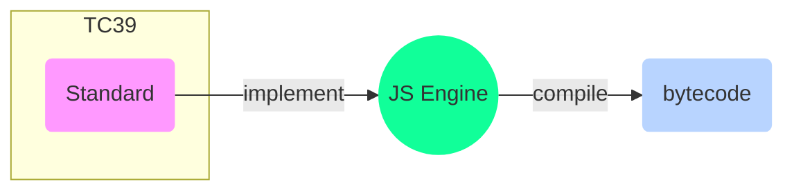
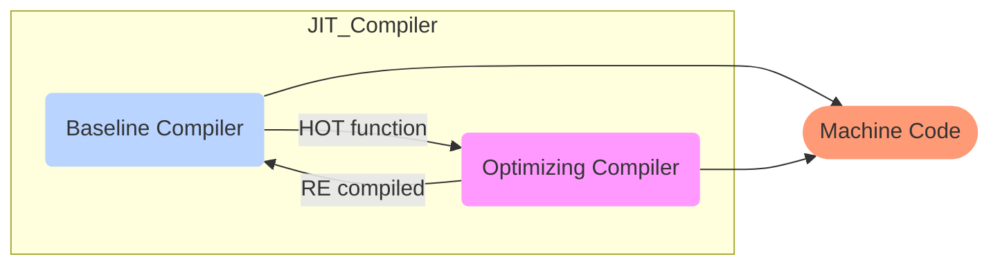
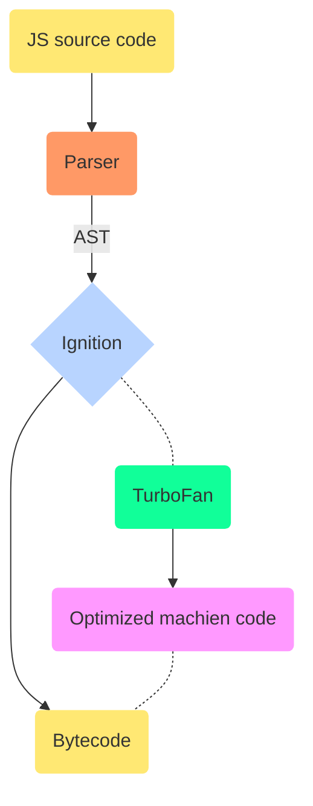

# JS Engine

<TagLinks />

> Really really low level javascript stuff

* `v8` is being built in germany for the most part
* Doesnt matter if you write in browser, nodejs or IoT device, everythign passes through engine
* Lots have been changes in past 20 years

js Engines | Used In
-----------|--------------
Chakra  | Edge
v8      | nodejs, electron
SpiderMonkey  | Firefox
DuctTape | |
JerryScript | IoT |

* NodeJs default build is with `v8`, but there are builds with chakra and spiderMonkey as well
* Electron is Chromium and v8
* Js is defined by ECMAScript standard by TC39 committee



* Dynamic | statically typed
  * faster, hence good for prototyping
  * do not have to worry about types all the time while writing s/w

```js
// javascript
var x = 17;

// C++
int x = 17;
```

## Objects

* Can add / delete anytime, do not have to declare beforehand

<<< @/../src/objects.js#snippet{1}

Why json are good?
:   sent over network all the time. API responses

    Its hard to know the structure / shape of json at clients so dynamically types
    language makes sense. Hence javascript Objects

    But it supporting dynimically types makes compiler harder

* Generate code Just In Time JIT, not Ahead Of Time AOT like in C++
  * JIT compilation is lazy
  * In C++, there are 2 steps
    * first compiler it then run it
  * In js, there is only 1 step
* Still considering JS is synamically typed, its pretty faster
  * How this improvements are made?
  * Hot functions are recompiled to make them faster



Compilation stages, Compiler Pipeline



In v8 Engine
Baseline Compiler = Ignition Interpreter
Optimizing Compiler = TurboFan

In SPiderMonkey, Optimizing compiler is IronMonkey

Safari has 2 low-level interpreter

* Optimizing compiler uses previously seen type information
* If we change the types all the time, then good optimized code cannot be generated
  * if it is already generated, it needs to be de-optimized, extra work
* In js we use property access all the time, but its fairly compilcated for the compiler
  * How compiler deals with property chains?
  * compiler doesnt know anythign about `obj.x`
  * where is this x?
  * Does this object has an x?
  * Is it under prototype chain?
  * Memeory address for x?
* How objects are represented internally?
  * Transitioning over higher types progressively as new data is seen
  * we can change types any time want, but internally compiler keeps track of types

Empty literal -> literal:x --> obj:x obj:y

* in ES6 new syntax for using a variable as a key in Object
  * much slower than ES5 ci=ounterpart,
  * ES5 have to make the literal
* optimize it for fast pass

```js
// ES5
function foo() {
  let o = {};
  o[x] = 1;
  return o;
}
// ES6
function foo() {
  return {[x]: 1}
}
```

* Try to write as much statically types js as possible, its best for your compiler
* C++ treats variables as locations in memory. Javascript treats variables ("properties") as hashmap-like entries within an object. Javascript programming feels like the manipulation of a large, dynamic property-tree structure.

String values are not implementation dependent, according the ECMA-262 3rd Edition Specification, each character represents a single 16-bit unit of UTF-16 text:

Would you agree that the statement "From a compiler's perspective, the best thing we can do is to write code that looks like it is statically typed", can be used as an argument in favour of TypeScript, which as I understand it naturally encourages us to write code that looks like it is statically typed. Hence, does writing our code using TypeScript make it more likely that the resulting JavaScript code can be optimised in a way that increases performance?

Using that argument, can it therefore be inferred that "using TypeScript makes our apps faster"?


## V8 Flags

v8 flags  | Description
----------|-------------
`--print-opt-code`  | code generated by optimizing compiler
`--print-bytecode`  | bytecode geenrated by interpreter
`--trace-ic`        | different object types a call sites encounters
`--trace-opt`, `--trace-depot` | which functions are (de)optimized

<Footer />
