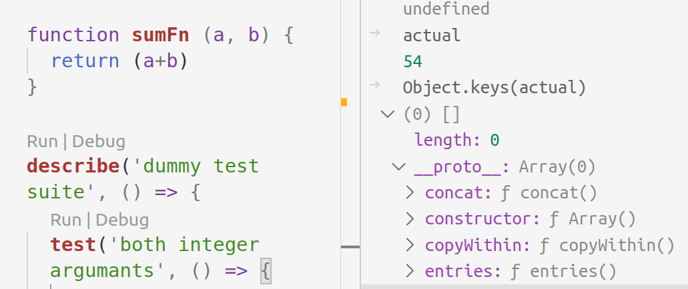

# __proto__

<TagLinks />

## What the hell is __proto__ ?

`__proto__` is the actual object that is used in the lookup chain to resolve methods, etc.
`prototype` is the object that is used to build `__proto__` when you create an object with new.

## References

* https://stackoverflow.com/questions/9959727/proto-vs-prototype-in-javascript

<Footer />
