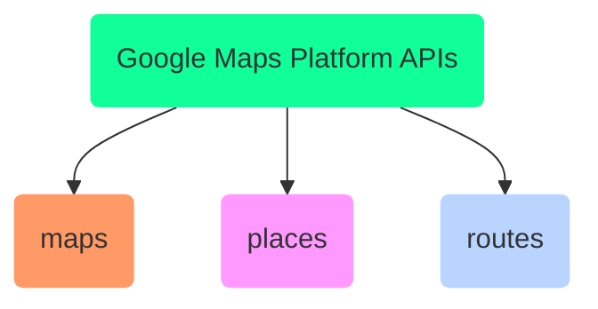
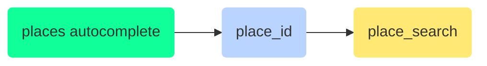

# google-maps

<TagLinks />

## Google Map platform [GMP]

### What can it do?



- [x] get directions
- [x] draw custom maps
- [x] lookup a place, geocoding and geolocation

::: tip API_kEY
is public available on website, requirnment of google
Maybe limit it to the domain of the website, so that not everyone can use it!
:::

#### MAPS API

1. visibility features, colors, dark mode
2. Markers and shapes
3. Custom graphics
4. animations
5. Data layer (static, dynamic js content)

#### Places API

1. place predictions, autocomplete
2. Address components
3. geocoding
4. geolocation
5. ratings
6. reviews



### How to use it? JS Implementations ?

1. [js-api-loader](https://github.com/googlemaps/js-api-loader/blob/master/src/index.ts)
2. Make your own implementation using web API standard

::: warning CORS
Google intentionally doesn’t allow access to the Google Maps API by way of requests sent with axios or AJAX methods in other such libraries, nor directly with XHR or the Fetch API.

[Google Maps API: No 'Access-Control-Allow-Origin' header is present on the requested resource](https://stackoverflow.com/questions/44336773/google-maps-api-no-access-control-allow-origin-header-is-present-on-the-reque)
:::

```js
import { useEffect } from "react";

// USAGE: useScript('https://use.typekit.net/foobar.js');
const useScript = (url) => {
  useEffect(() => {
    const script = document.createElement("script");
    script.src = url;
    script.async = true;
    document.body.appendChild(script);

    return () => {
      document.body.removeChild(script);
    };
  }, [url]);
};

export default useScript;
// generic to more specific => useGoogleMapScript() already knows src url
```

## 3rd party libraries

| library                    | what does it do?                                             |
| -------------------------- | ------------------------------------------------------------ |
| `googlemaps/js-api-loader` | creates a single (with id) script tag for google-maps        |
| `PlacesAutocomplete`       | expects a render props function as props.children            |
| vanilla JS                 | look for event and define right callback from google map API |

<<< @/../src/vanilla/maps.html

<iframe width="560" height="315" src="https://www.youtube.com/embed/c3MjU9E9buQ" title="YouTube video player" frameborder="0" allow="accelerometer; autoplay; clipboard-write; encrypted-media; gyroscope; picture-in-picture" allowfullscreen></iframe>

<iframe width="560" height="315" src="https://www.youtube.com/embed/uJYqQdnw8LE" title="YouTube video player" frameborder="0" allow="accelerometer; autoplay; clipboard-write; encrypted-media; gyroscope; picture-in-picture" allowfullscreen></iframe>

## FAQ

[Difference between Google's Query and Place Autocomplete?](https://stackoverflow.com/questions/62121238/difference-between-googles-query-and-place-autocomplete)

[gmp]: https://developers.google.com/maps

<Footer />
