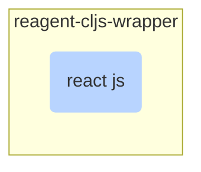

# Reactive Programming

<TagLinks />

How to do reactive programming with `cljs`?

## Reagent

[What are Form-1, Form-2 and Form-3 components?](https://betweentwoparens.com/what-the-reagent-component)

#### What problem does it solve?

- [x] Immutable reactive states for react components
- [x] T1, T2 and Type-3 components
- [x] `reagent.core/render` to inject/add components into DOM
- [x] `reagent.core/unmount-component-at-node container` removes a c7t from DOM

| component types   | description                                                  |
| ----------------- | ------------------------------------------------------------ |
| Form 1 components | no render function, dumb components                          |
| Form 2 components | with render function, Higher order Functions, **localstate** |
| Form 3 components | using full react methods                                     |

## Google Closure Library

well tested, cross browser compatibility is given (polyfills)

#### What can google closure library do?

- DOM Manipulation
- Server Communication
- Animations
- Data Structures and math functions
- UI Widgets
- Events

<!-- prettier-ignore -->
*[c7t]: Component, readily usable UI Elements

<Footer />
