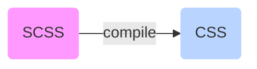

# UI PLanning

<TagLinks />

## Questions to ask

### Component Library

### Which Event system to choose and why?

1. `goog.dom`, `goog.events`
2. `reagent.core` comes with react Event Handlers

### Which DOM Manipulation library to use, why?

1. Google Closure Library
2. Reagent DOM
3. vanilla JS via js Interop

### Data Informational Model

- Cascade subscriptions, todos is used as input to num-completed subscription

```clojure
(rf/reg-sub
  :num-completed
  :<- [:todos]
  (fn [todos]
    (count (filter :done? todos))))
```

- Self aware components for data validations?

### Data validations

- Show validation only when its relevant, complex chaining with multiple inputs. Use isVisited and isActive flags

### Wooleybear

> How bulma CSS works?



> How to make free `icons`! works?

Add this to HTML `<script defer src="https://use.fontawesome.com/releases/v5.3.1/js/all.js"></script>`

> Which CSS preprocessor to use?

`node-sass` is About **7 times faster** than `sass`. [Source](https://www.peterbe.com/plog/quick-comparison-between-sass-and-node-sass)

Simple [stylus](https://stylus-lang.com/) everything on single page

> How to use HTML data-attributes in clojurescript? How to remove list items on click?

[Vanilla JS Example](https://www.w3schools.com/tags/tryit.asp?filename=tryhtml5_global_data)

## Questions

1. Should I keep the states outside c7t or inside of c7t?
2. How `react` helps when we already have `vanilla js` dom manipulation APIs ?
3. [How to change class attribute from cljs?](https://stackoverflow.com/questions/56588947/how-to-hide-show-a-table-in-clojurescript)
4. How to create new fighweel project? `lein new figwheel jq-inter`
5. When to `ref` and `deref` items?
6. Difference b/w `:as` and `:refer`?

<Footer />
