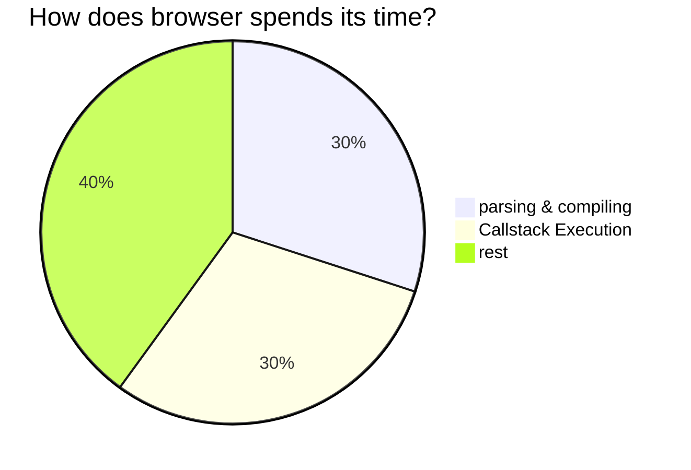

# :hammer_and_wrench: devtools

<TagLinks />

## Memory consumption in node and chrome?

::: quote devtools tech-lead @google
v8 is the fastest [JavaScript engine](./jsengine.md)
:::

- Top most reason for chrome crashing today
  - due to bugs in web-apps called **memory leaks**
- There is more traffic coming from mobile and IoT, kind of restricted with memory

$$ Performance \propto \frac{1}{Memory \, Consumption}$$

## Memory Hierarchy in modern computers

- #cpu cores packaged into chips
- sharing a global memory called RAM
- Access to memory is synchronized within all cores in some fashion with limited memory bandwidth

::: tip CPU core
CPU cores itself have their own **registers** and **L1**, **L2** level **caches**.

Additionally a third layer **cache L3 shared** by all the cores
:::

- Mind your memory footprint
  - avoid crashes due to **out-of-memory**
  - benefit from faster caches(which are limited in size)

### What has v8 done in this direction?

light version of v8 for mobile

::: tip regEx in v8
memory occupied by regular expressions

==751 bytes of machine code== just for regex `/./` dot operator

- regex are generally executed more than once
  - 1st execution uses interpreter and
  - subsequent calls to regex uses optimization engine
- regex improvements by **29%** in real websites

:::

## How JavaScript objects are represented in memory?

==**~70%** of manged memory is pointers (_small integers_)==

- engine starts with sentinel pointers, and shape
  - chrome limits memory to **2 or 4 GB** depending on system in use
- Pointer Compression? as most of data (70%) is pointers
  - compress the biggest chunk in memory
  - disable by default for nodejs
  - 4GB compressed $\approx$ 6 to 8 GB uncompressed, 20-30% reduction in size

[How does browser spends its time?](https://www.html5rocks.com/en/tutorials/internals/howbrowserswork/)



### Example with real website like Facebook

- ==30% of time is parsing and compiling==
  - which is almost similar to time spent on executing the script
- How to you improve it?
  - stack trace
  - team look out the nitty gritty of it and micro optimized the shot out of it
  - chrome 75 can now parse Facebook js
- Too much surprise, ==JSON parsing is faster than js Object==
  - Why is that?
  - `JSON.parse()` call expression with a single argument
  - js `object` has far more tokens
    - each property name is identifier or a string like literal
    - values could be anything - nested Objects, Arrays
    - work harder to tokenize it correctly

::: tip JS Parsing

> Pretend you are the parser and looking at source code character by character

Parsing **javascript** is hard because its **context sensitive**.

parsing **JSON** is comparatively easy as its **context insensitive**

::: right
[Reference v8 document link](https://v8.dev/blog/cost-of-javascript-2019)
:::

- How to use this micro optimization?
- tooling can help, yet keeping you source code readable
  - json-parse-webpack
  - babel-plug-object-to-json-parse

```js
const data = { foo: 123, bar: 456 };
// equivalent
const data = JSON.parse('{"foo":123,"bar":456}'); // faster
```

### Metric jenk

- Main thread blocked for work, like user-interactions, scrolling, page load
- Chrome uses `resourcePreloader`

  - `defer` loading script

- Google metrics called TTS - Time to Shakira
  - time to load facebook shakira page
    - facebook sends 30 mb of scripts with each page load
  - load google sheets

## New features

- most requested feature - `top-level-await`
- REPL mode

<Footer />
