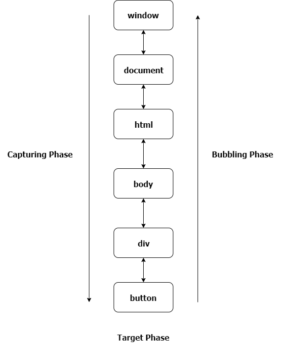

# Event Listner

<TagLinks />

## What are Event Listners and event Handlers?


the callback accepts a single parameter: an object based on Event describing the event that has occurred, and it returns nothing.

```js
event.type;
event.target.matches(".close");
```

What can I do with Event Object Properties?

: Things like

    - [x] check event `types` and `target`.
    - [x] Is `bubbling` or not? Stop `propagation`?
    - [x] create **NEW** event based of this event
    - [x] return epoch time when it was created?

::: warning Almost all events bubble
Almost, For instance, a focus event does not bubble. There are other examples too, we’ll meet them. But still it’s an exception, rather than a rule, most events do bubble.
:::



## Methodic Approach

What are event listners?

: Browser is a Event Driven System

    We can do reactive programming using listening to events and acting upon them.

    EventListener is a function that will be called whenever the specified event is delivered to target

    $target = \{ element, document, window, XMLHttpRequest \}$

::: tip Event propagation rationale
In real world, when an accident happens, local authorities react first.
They know best the area where it happened. Then higher-level authorities if needed.

:::

How does a Event propagate in browser?

: The concept of event propagation was introduced to deal with the situations in which multiple elements in the DOM hierarchy with a parent-child relationship have event handlers for the same event, such as a mouse click. Now, the question is which element's click event will be handled first when the user clicks on the inner element: the click event of the outer element, or the inner element?

    phase | description
    ------|-------------
    `capturing` | propagate event **down** to the child $window -> target$ eventListener(, ,**true**)
    `bubbling` | propagate event **up** to the parent in DOM, invoking their respective eventHandlers $target -> window$, is default default eventListener(, ,**false**)

    [Live Demo](https://www.permadi.com/tutorial/jsEventBubbling/eventbubbleform.html)

    

How to stop event propagation via bubbling? it could be undesired after its handleded once?

: Any event handler can decide to stop the propagation via `event.stopPropagation()`

    Can stop bubbling in case it has interfering with or has side effects with other event listeners `stopPropagation()`

::: warning stopping propagation pitfalls
For instance:

1. We create a nested menu. Each submenu handles clicks on its elements and calls stopPropagation so that the outer menu won’t trigger.
2. Later we decide to catch clicks on the whole window, to track users’ behavior (where people click). Some analytic systems do that. Usually the code uses document.addEventListener('click'…) to catch all clicks.
3. Our analytic won’t work over the area where clicks are stopped by stopPropagation. Sadly, we’ve got a “dead zone”.

:::

What is **Event Deligation?**

: Event delegation provides the simplest way to listen for events on ==multiple elements== or ==future elements== which are **not** yet added to DOM but will be added eventually in future.

    ::: tip Event Deligation
    Query the Elements in DOM, then sequentially assign same eventListener to all selected elements

    :heavy_plus_sign: Event listener **behaviour re-use!**
    :::

    With a traditional approach, attaching listeners to specific elements, you would need to add a new listener every time you added a field. With event delegation, you can setup your listener once and not have to worry about it, ==since it checks selectors at time of click rather than when the DOM is initially rendered.==

    Same even listener to multiple elements, all elements with same class? Event Deligation

    ```js
    //event deligation
    var clickMe = document.querySelectorAll('.click-me');
    for (var i = 0; i < clickMe.length; i++) {
    clickMe[i].addEventListener('click', function (event) {
        // Do stuff... }, false);
    }
    ```

What happens when using multiplt Event Handlers?

: Notice that there are a sequence of order of the events: onmousedown, onmouseup, then onclick. The order could be important on some programming purposes.

How does a event propogate in DOM? What are the stages of events?

: When an element in the DOM is clicked, the event bubbles all the way up to the parent element (the document and then the window). This allows you to listen for events on the parent item and still detect clicks that happen inside it.

Vanilla js event listners vs jQuery event listners?

: jQuery can listen events on classes, vanilla js only on single DOM Element

    <code-group>
    <code-block title="JQUERY">
    ```js
    $('.click-me').click(function (event) { ... });
    ```
    </code-block>

    <code-block title="VANILLA JS">
    ```js
    document.querySelectorAll('.click-me')
    .addEventListener('click', function (event) {
      ...
    }, false);
    ```
    </code-block>
    </code-group>

Difference between and when to use event.preventDefault(), event.stopPropagation() and return false?

When is `preventDefault` useful?

: When assigning a event handler on anchor tag element with `href` attribute, default behaviour is on click browser will navigate to href. You can prevent that and assign you own custom click event handler

## [React synthetic Events](https://reactjs.org/docs/events.html)

- react's synthetic events works in a similar way across all browsers
- get native browser event via `nativeEvent`
- easy API to pass arguments to Event Handlers

React uses event delegation with a single event listener on document for events that bubble, like 'click' in this example, which means stopping propagation is not possible; the real event has already propagated by the time you interact with it in React. stopPropagation on React's synthetic event is possible because React handles propagation of synthetic events internally.

```js
stopPropagation: function(e){
    e.stopPropagation();
    e.nativeEvent.stopImmediatePropagation();
}
```

### Resources

- [list of events supported in firefox](https://developer.mozilla.org/en-US/docs/Web/Events)
- [event Object Propertues](https://www.w3schools.com/jsref/obj_event.asp)
- [praactical use of event bubbling](https://www.permadi.com/tutorial/cssHighlightTableRow/index2.html)

<iframe width="560" height="315" src="https://www.youtube.com/embed/sfKDOOJgbSI" title="YouTube video player" frameborder="0" allow="accelerometer; autoplay; clipboard-write; encrypted-media; gyroscope; picture-in-picture" allowfullscreen></iframe>

<Footer />
