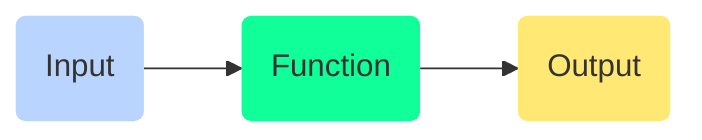

# Functional Programming

<TagLinks />

- Languages `clojure`, `haskell` supports functional style of programming
- `javascript` supports multi-paradigm including functional programming

::: tip Differences with OO

#### Object Oriented Programming Core Pillars

1. **A**bstraction
2. **E**ncapsulation
3. **I**nheritance
4. **P**olymorphism

:::

## What makes programming Functional Programming

Indivudual tasks/operations are written as functions



**PURE FUNCTIONS** Functions which return same o/p for same i/p every single time

How to check if function is pure or not?
How to make a function pure if not pure already?

```js
// impure functions due to minAge
function isEligible(age) {
  return age > minAge;
}

// lets make it pure
function isEligible(age, minAge) {
  return age > minAge;
}
```

Advantages of pure Functions

1. Cachable
2. can be executed Concurrently
3. Easily testable
4. self-documenting

## Core Concepts

- Functional programming stresses heavily on **Immutability**
- js is NOT very strictly immutable, <Badge type="tip" vertical="middle" text="Consider" /> Mutating objects directly
  - `const` prevents `re-assignment`, and does not make it immutable
  - External Libraries, `immutable`, `immer`, `mori`

#### Higher Order functions

Takes functions are arguments, or return functions, or both

<Badge type="tip" vertical="middle" text="For Example," /> `Array.map(fn)`, `setTimeout(callbackfn, time)`

#### Composition

#### Currying

```js
function add(a) {
  return function(b) {
    return a + b;
  };
}

add(1)(5); // add(1,5)
```

::: tip lodash/fp
Use `lodash/fp` for functional programming
:::

- https://dev.to/suprabhasupi/currying-in-javascript-1k3l

## Others

- Shallow copy and deep copy example with spread operator `...`

## Questions

- What is the difference b/w `var`, `const` and `let` keyword in javascript?
  - var makes variables local to function irrespective of block where its used.
- What is `this` keyword in javascript?
- Are `classes` `Objects` in javascript?

<Footer />
