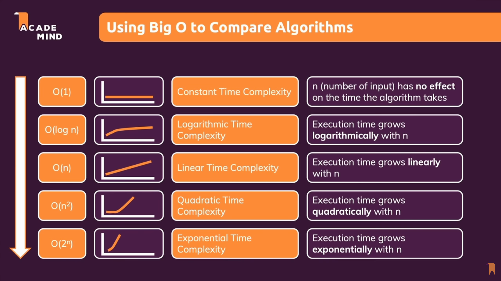

# :bar_chart: Performance

<TagLinks />



## Time and space complexity

| term             | description                                 |
| ---------------- | ------------------------------------------- |
| time complexity  | time $\propto$ #inputs (not Execution time) |
| space complexity | How much memoery is consumed                |

How to measure and analyse the complexity of your algorithm?
: Asymptotic Notation / Analysis Big-O $O()$

    - How many times an instruction runs? How often?
    - Narrow down variables in function to ==fastest growing expression==

| Notation    | Time complexity  |
| ----------- | ---------------- |
| $O(1)$      | constant Time    |
| $O(log\ n)$ | Logarithmic Time |
| $O(n)$      | Linear Time      |
| $O({n}^2)$  | Quadratic Time   |
| $O({2}^n)$  | Exponential Time |

How to accurately measure runtime of js script in node?

```js
performance.now();
```

- https://blog.abelotech.com/posts/measure-execution-time-nodejs-javascript/
- https://stackoverflow.com/questions/10617070/how-do-i-measure-the-execution-time-of-javascript-code-with-callbacks

<Footer />
