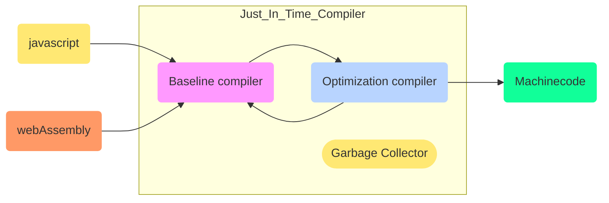

# :small_airplane: v8 Engine

<TagLinks />

::: quote


v8 is Javascript runtime in chrome and nodejs
:::

- ==Asynchronous IO is based in Event Loops==
  - use `libuv` for that
- **100k lines** of JS and C++ code, glue between `libuv` and `v8`
  - inbuilt node modules, standard modules

::: tip v8 what?
called by many names

v8 $=$ Js Runtime $=$ js Engine $=$ compiler $=$ virtual machine
:::

- Just In Time compiler
  - compile a little bit and run, compile a little bit and run it automated
  - speculative optimization
- written in C++
- Implements javascript according to ECMA Specification
  - Everytime there are modifications in specifactions, they are added to runtime
- Garbage Collection
- WebAssembly is also a part of v8 starting 2019
  - https://www.infoq.com/news/2020/02/v8-webassembly-simd/
  - https://www.google.com/search?q=javascript+v8&newwindow=1&sxsrf=ALeKk03qxPq35f3dJ7-IpoVOJFVTlheQSA:1596773429800&source=lnms&tbm=nws&sa=X&ved=2ahUKEwj2n8fInIjrAhVDNOwKHUlvCq0Q_AUoBHoECEIQBg&biw=1294&bih=641

::: warning not in v8

1. DOM data structure is **NOT** the responsibility of js engine. Its created by browser application
2. No File System access. `libuv` is used for FSOperations
3. console, responsibility of node or chrome app to provide it.

:::

- Majority of v8 team in Munich, Germany
- Same release schedule as chrome, every 6 weeks
- **v8 API** is a part of ECMA Script specification which is exposed to node or chrome
- v8 compiler pipeline change - support for node 8
  - Full Cogent and crankshaft -> **ignition and turbofan**
  - ABI - Application Binary Interface guarentee to support node LTS version for stability
  - node v8 integration bot
- since node 7 use devtools and CDP protocol for debugging
- node is a first class citizen in v8 now

## :card_file_box: Heap vs Stack

the standard distinguishes automatic and dynamic storage duration. Local variables have automatic storage duration and compilers store them on the stack. Objects with dynamic memory allocation (created with new) are stored on the free store, conventionally referred to as the heap. In languages that are not garbage-collected, objects on the heap lead to memory leaks if they are not freed.

- https://fhinkel.rocks/2017/10/30/Confused-about-Stack-and-Heap/
- [Whats faster, C++ or JS?](https://fhinkel.rocks/2017/12/07/Speed-up-Your-Node-js-App-with-Native-Addons/)

## Who uses it?

- node
- electron

## Official documentation

- If you are a C++ developer you can use v8 in your Application
- How javascript is used?
  - Manupulate DOM
  - v8 exposes all datatypes, operators, functions and objects as specified in ECMAScript standard
- Uses ==Code Caching Technique==
  - cached data is availble to seperate v8 instance as well
  - `v8::ScriptCompiler::Source::GetCachedData`



| JIT Units             | Codenames |
| --------------------- | --------- |
| Garbage Collector     | Orinoco   |
| Baseline Compiler     | Ignition  |
| Optimization Compiler | Turbo Fan |

## :chart_with_downwards_trend: Tracing

```
node --trace-events-enabled tracing.js
```

- How to view, read trace?
  - Google chrome have built in trace viewer
  - `chrome://tracing`

<!-- prettier-ignore -->
*[DOM]: Document Object Model, data structure maintained by browser to render boxes

<Footer />
