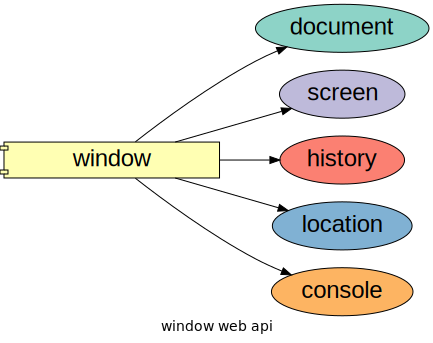

# Web Worker

<TagLinks />

WebWorkers offload some task from **main thread** on web page

::: tip
JS is **single** threaded programming language
:::

- Have access to
  - Navigator Object
  - XML/HTTP request Object
  - Location Object
  - set time, fetch api

::: warning
Web worker **DO NOT** have access to DOM
:::

If `$` is used on window $\implies$ jQuery is being used on webpage

```js
worker = new Worker("web-worker-task-1.js");
worker.addEventListner("message", workerMessaged);
worker.addEventListner("error", workerError);
worker.postMessage('Get Started')                 // Deep Copy
output.addEventListner('click', () => {
  worker..postMessage('another message passing')
})
```



## Resources

### Introduction to web worker

<iframe width="560" height="315" src="https://www.youtube.com/embed/EiPytIxrZtU" frameborder="0" allow="accelerometer; autoplay; clipboard-write; encrypted-media; gyroscope; picture-in-picture" allowfullscreen></iframe>

<Footer />
