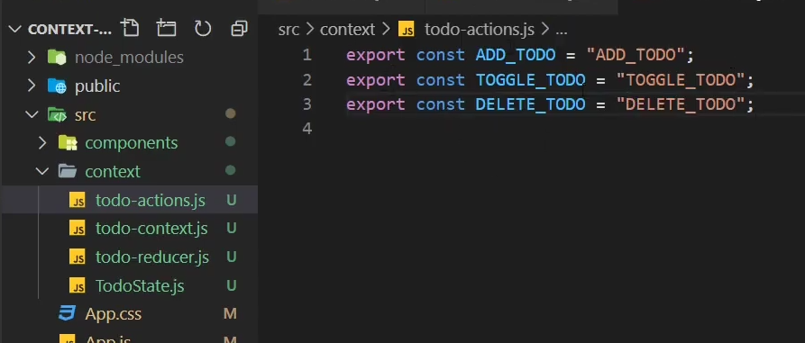
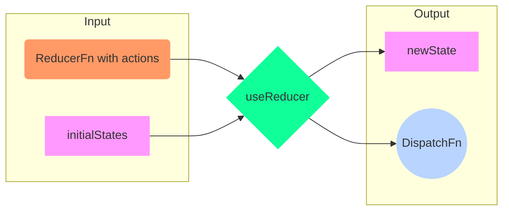

# React Hooks

<TagLinks />

Born as an RFC in **November 2018** they caught up quickly and landed in **React 16.8.**

Inject your code into react lifycycle using hooks provided by react.

- [x] Share logic between components

## useState

## useEffect

imitation of ComponentDidMount

```js
  const [data, setData] = useState("Click me, please");

  useEffect(() => {
    fetch("http://localhost:3001/links/")
      .then(response => response.json())
      .then(data => setData(data));
      .catch(error => console.log(error))
  }, []);  // => that is, variables on which useEffect depends on to re-run.
```

Close websocker connection after opened in useEffect
: **return a function** to clean up the effect, that is, a function which runs when the component unmounts.

    cleanup after component is removed, unmounted

    ```js
    useEffect(() => {
        const socket = socketIOClient(ENDPOINT);
        socket.on("FromAPI", data => {
        setResponse(data);
        });

        return () => socket.disconnect();
    }, []);
    ```

## custom Hook

- Persist input value in local storage and backend server

How to reuse component logic using customHooks?
: try this

    ```js
    import { useState, useEffect } from "react";

    export default function useFetch(url) {
    const [data, setData] = useState([]);

    useEffect(() => {
        fetch(url)
        .then(response => response.json())
        .then(data => setData(data));
    }, []);

    return data;
    }

    const data = useFetch("http://localhost:3001/links/");
    ```

::: warning asyn/await with useEffect
Turns out you cannot return a Promise from useEffect.

This wont work! Console will scream

```js
import { useState, useEffect } from "react";

export default function useFetch(url) {
  const [data, setData] = useState([]);

  useEffect(async () => {
    const response = await fetch(url);
    const data = await response.json();
    setData(data);
  }, []);

  return data;
}
```

:::

Usinf async/await with useEffect?
: use This

    ```js
    import { useState, useEffect } from "react";

    export default function useFetch(url) {
    const [data, setData] = useState([]);

    async function getData() {
        const response = await fetch(url);
        const data = await response.json();
        setData(data);
    }

    useEffect(() => {
        getData();
    }, []);

    return data;
    }
    ```

## useReducer



- complex state changes in React components.
- These actions end up in a reducer function to calculate the next state:
- Reducer function takes a `state` and **action**
- Action might havr a `type` and `payload`




#### Use clases

- Calculator webapp
- Custom add-Ons (which increases the price) on a product buy page
- reduced sum of nested arrays

## useContext

Accepts a context object (the value returned from `React.createContext`) and
returns the current context value for that context

- Which components can access global store data? Provide to components?
- Basic setup, writing to use `useContext`?

## useCallback and useMemo

`useCallback(fn, deps)` is equivalent to `useMemo(() => fn, deps)`.

## useRef

- The returned object will persist for the full lifetime of the component.
- set via `.current` property of Element

#### use case

- [Forward Reference](https://reactjs.org/docs/forwarding-refs.html) to other Components

1. To access the DOM: `<div ref={myRef} />`
2. Store mutable value like instance variable (in class)
3. A render counter
4. A value to be used in setTimeout / setInterval without a ==stale closure issue.==

```js
const FancyButton = React.forwardRef((props, ref) => (
  <button ref={ref} className="FancyButton">
    {props.children}
  </button>
));

// You can now get a ref directly to the DOM button:
const ref = React.createRef();
<FancyButton ref={ref}>Click me!</FancyButton>;
```

## useMemo

- Returns a memoized value.
- Pass a “create” function and an array of dependencies
- useMemo will only recompute the memoized value when one of the dependencies has changed. This optimization helps to avoid expensive calculations on every render.
- Remember that the function passed to useMemo runs during rendering

## useLayoutEffect

The signature is identical to useEffect, but it fires synchronously after all DOM mutations. Use this to read layout from the DOM and synchronously re-render.

## useDebugValue

useDebugValue can be used to display a label for custom hooks in React DevTools.

## react-router-dom

> Make **Bookmarkable** app states

- Make router available to the parts of app that would need it.
- How to add new route? and render new components?
- `Link`, `Route`, `Switch exact` to only 1 component from list, `path="/g/:gistId"`
  - then app finds and filters `gistId` from the available collection
- Can use slots, this.props.children pattern or pass as props
- [Common pitfalls](https://medium.com/@shoaibbhimani1392/react-router-frequently-faced-problems-f7d30d02087e)

## Exercises

- Build trello like drag and drop area
- Trading Platform like buy/sell options
- [Production Use cases of hooks](https://stackoverflow.com/questions/66429202/what-are-production-use-cases-for-the-useref-usememo-usecallback-hooks)
- https://github.com/gopinav/React-Tutorials

<iframe width="560" height="315" src="https://www.youtube.com/embed/zxP4oGejqpU" title="YouTube video player" frameborder="0" allow="accelerometer; autoplay; clipboard-write; encrypted-media; gyroscope; picture-in-picture" allowfullscreen></iframe>

<Footer />
