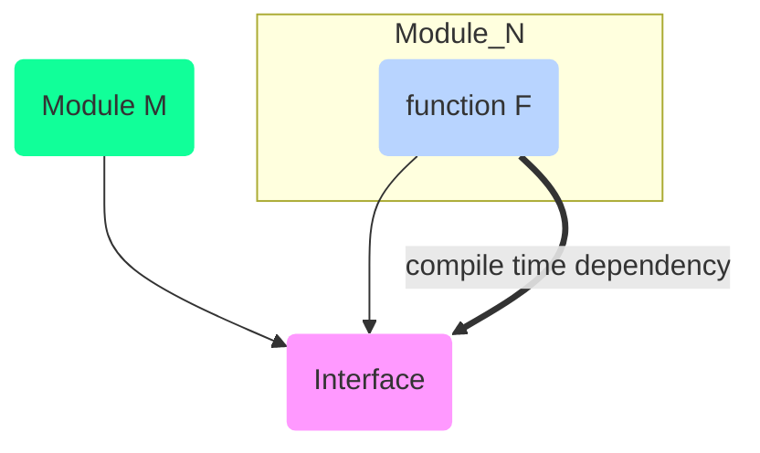

# Uncle Bob - Robert C Martin

## Clean Architecture and Design

* privilages son of a god.
* [Age of earth](https://www.google.com/search?q=age+of+earth&oq=age+of+earth) $\sim$ **4.5 billion years**
* Dianosaures are very recent, just with in a last 100 years or so.
* When did life crawl out of the oceas?
* Life began and stayed in ocean for **3.5 billion years**
* How important s/w is today? How much s/w is running on your body today?
  * how many processors are around you?
  * Now a days its cheapers to filer out 50 cycle [hums](https://en.wikipedia.org/wiki/Mains_hum) in speakers using s/w
    * C s/w performing some [fast fourier transform](https://en.wikipedia.org/wiki/Fast_Fourier_transform)
  * A modern car has 100 million lines of code running inside it.
  * There is an `if` in the electric drive system of car
    * How many people have died because of s/w error?
      * Several dozen, [toyota](https://www.reuters.com/article/us-toyota-motor-recall/toyota-to-recall-nearly-6-5-million-vehicles-for-steering-other-faults-idUSBREA380AR20140409)
* [Knight Capital](https://en.wikipedia.org/wiki/Knight_Capital_Group) lost **450 millon $ in 45 mins**.
* s/w you and I write can kill people, can loose money.
* Nothing can be done in western society without interacting with s/w system.
* Volkswagen usa CEO testemony to USA congress, blame on programmer
  * it was just a couple of s/w developers who did it for whatever reason
  * When politicians point finger at us, adn ask how can you let **10,000 people** die at a stroke?
* What our ethics are?
* What are our standars that we dont go below?
* What are the disciplines we adhere to and how do we enforce them?
  * An accident yes, but not due to negligence

::: tip programmers
1946, How many programmers were there in the world?
:   1, [Alan Turing](https://en.wikipedia.org/wiki/Alan_Turing)

How many programmers are there in the world today?
:   could be $\sim$ **100 million**

In 73 years we have grown from 1 to 100M, what kind of growth is that?
:   definately not linear, maybe exponential. But then whats the base?

Number of programmers double every 5 years? roughly. We are already like **0.8%** of the popullation

Programmers would be in a state of perpetual inexperience < 5 years
:::

* Society depends on you.
* So its important that you learn to organize your software well
  * First thing that you should see is what the s/w is supposed to do! Not the framework.
* Web is an IO device, back in 1960s we dont want to know which IO system we are using.
  * In UNIX programming, we dont write to a device. Instead, we write to a abstraction `stdout`
* The architecture of the s/w yell/scream at you its intentions, like how a church and library does.
  * intent and shape of system, dependency b/w components.

> Web is the Detail

* Most important books on softwares written within last 30 years
  * [Ivar Jacobson](https://en.wikipedia.org/wiki/Ivar_Jacobson) 1992 Object oriented s/w engineering
  * Design Patterns
  * [Structure_and_Interpretation_of_Computer_Programs](https://en.wikipedia.org/wiki/Structure_and_Interpretation_of_Computer_Programs)
* Use cases $\sim$ User story $\sim$ Objects
  * Dont assert details far too soon
  * Programmers are the detail managers, we have to deal with worst possible details
    * check if a file ends with `\n` or `\r`
  * Interactor is a business rule, 2 types of business rules
    * **Entity** application specific business rules, which are automated.
    * Applicaiotn independent, business rules which would still be used even if there are no computers, like interest calculation for a banking system
  * Boundaries are Interfaces
* Only the Interactors talk to the boundaries (Interfaces), entities dont know about the outside world.
  * Can you test a interactor sttingi n Atlanta sipping jin and tonic? without running the rest of the system.
* For web (delivery mechanism)
  * Interactor gets data from input device (probably web button/form) and puts it into a data structure called request model.
    * does not depend on anything, plain old language object
  * Interactors begin to inspect it., what the interaction is supposed to be by looking at request model.
    * controls the dance of entities
  * Interactor then build a result model gathering all the answers in the opposite direction
* Test your systems in parts

* `Java` and `C#` are same languages, microsoft stole java, earlier it was **visual j++**
* `Go` is one of those languages which lets you see how fast your machine really is. Unlike `java` there is no startup time. Issue execute command wait for sometime, and then bam you go.
* Service Oriented Architecture $\sim$ Micro-services

* [MVC pattern](https://en.wikipedia.org/wiki/Model%E2%80%93view%E2%80%93controller)
  * Model - Business rule, doesnt know how it gets its input and how it gets its output
  * View - How to display contents of model to outside world
  * Controller - Know how to accept input from outside world and hand it into Model
  * implemented in **SmallTalk**
    * MVC for every individual component at the small level
    * MVC on web is very cluttered.
* How to get data out to web? or any other IO device?
  * MVC at app level could be a bad idea, no clear boundary, some controller looking code in view and model etc.
  * Add a **Presentor Layer** reformat data in response model. as per the needs
    * price as per the locale, right currency marks etc
    * Any decision made about the screen is made by presentor.
* Web is a plugin for Business Rules
* All hail the database, all other things bow down to database because its everything.
  * Wrong view, its another IO device
  * Who would say that, db is the centre of everything?
    * DBA's and database companies on 80s, 90s

* [Fitness](https://en.wikipedia.org/wiki/FitNesse) java wiki tool, uncle bob wrote it with his son

What to test and How much code coverage?
:   You only test the parts of the application you want to work

    100% code coverage is asymptotic goal but then you never stop trying.

    * GUIs are in particular harder to test
    * HOw to test pixels? Testing in general over the edge of the system is hard

How do we communicate the intent of s/w that we are developing with the s/w directory structure?
:   Nice to have a Use-case and entity (independent business rules) directories and promote them at the top of s/w

Should we be using frameworks to solve our problem?
:   Framework authors and users have very assymetric relationship

    * Framework author wrote framework to solve **their** problem, they are not solving **your** problem
    * They love the framework, you dont! Don't couple so tightly
    * Over time, framework might fight you and cost you more. They are NOT pure good.

    * Don't overuse [Dependency Injection](https://en.wikipedia.org/wiki/Dependency_injection)
    * Write your code in a decoupled way, such that you can change Dependencies in future
      * Inject dependencies, into a safe place behind the architectural boundary.

## SOLID Principles of Agile OO Design

* Helped push Agile manifesto
* Water is H~2~O, mickey mouse like structure. What holds it in place?
  * Why is water good for washing? Because it can stick to dirt.
    * It will dissolve everything. It has memory
* How does bad code slows you down?
  * Coupled system - have to make changes at multiple files, propogating changes
  * Fragility - once change and everything unrelated breaks
  * They typed crap - spaggeti code
* Procedural Functional call Tree - every application has
  * starts with main and explodes down the system
  * Flow of control goes downwards
  * Which of the modules knows about the other?
    * Source code dependency from M $\rightarrow$ N using `#import` or `import`
    * Compiler resolves these at runtime

> High level modules knows about the low level modules. Which principle does it violate?

* Do we want out high level policy polluted by low-level detail?
  * Makes code harder to read
* Why is OO part of every languague that we work on these days?
  * Python is $\sim$ ruby
  * Earlier there was no OO in `fortran`, `cobol`. Why what happened then?
* Objective-C in 1980's
  * He was a smallTalk programmer, somebody made him porgram in C, he hated it
  * He wrote a small preprocessor in front of `C` and gave it some smallTalk attributes
  * And then `C++` came in
* Do we have encapsulation in `C`?
  * We had perfect encapsulation.
  * Forward declare functions in header file `.h` and then implement them in `.c` file
  * Objects completely screwed that up
    * C++ put all the variables in header files, now all variables are visible to everyone
    * implement hackey wrorks `private`, `public`, `protected`, `static` etc.

> OO did not give us encapsulation, it weakened encapsulation. It destroyed original encapsulation (as in C) and replaced it with hackey public, protected, private, static jargons

### Inheritance

* Why doesnt java, C# have multiple Inheritance?
  * java solved it by hackey Interfaces
  * But we cannot inherit Interfaces - a lazy hack
* All in dynamically typed languages (python, ruby) we can have Polymorphism without Inheritance
  * Inheritance is NOT necessary for polymorphism
* No Inheritance is needed for duck-types
* Inheritance in dynamic types languages is used to inherit the behaviours and variables but **NOT** interfaces
* With java, and C# we need inheritance to use Polymorphism

### Polymorphism

* Do we have polymorphism in C?
  * Not very much, because it was dangerous as hell.

::: tip IO Driver
Every IO driver have to implement these 5 magical functions

1. Read
2. Write
3. Open
4. Close
5. Seek

OS will take pointers to these functions and put them into a table
:::

* Does java have pointers to functions?
  * No, because they have polymorphism
* As soon as `C++` came along, we have cheap, easy, safe Polymorphism
  * Module M $\rightarrow$ N calling function `F`
* With Polymorphism we can do this,
  * module M can mention the name of interface to use F
  * module N will derievve from that interface
  * Now, compile time dependency points against the flow of control, instead of with the flow of control
  * You have absolute control over your dependencies by carefully deciding which direction the arrows points towards. Thats what OO is.

OO is about managing dependencies by selectively re-inverting certain key dependencies in your s/w so that
you can avoid rigidity, fragility and non-reusability

Enter SOLID

* Conside selling circle, squares `jars` on your website?
* 1988 was a good year for principles

## Resources

* https://youtu.be/oIhn-l0y6dI
* [Business Logic](https://en.wikipedia.org/wiki/Business_logic)

<iframe width="560" height="315" src="https://www.youtube.com/embed/2dKZ-dWaCiU" frameborder="0" allow="accelerometer; autoplay; encrypted-media; gyroscope; picture-in-picture" allowfullscreen></iframe>

<iframe width="560" height="315" src="https://www.youtube.com/embed/YdJAfqo6_s0" frameborder="0" allow="accelerometer; autoplay; encrypted-media; gyroscope; picture-in-picture" allowfullscreen></iframe>

<iframe width="560" height="315" src="https://www.youtube.com/embed/QHnLmvDxGTY" frameborder="0" allow="accelerometer; autoplay; encrypted-media; gyroscope; picture-in-picture" allowfullscreen></iframe>