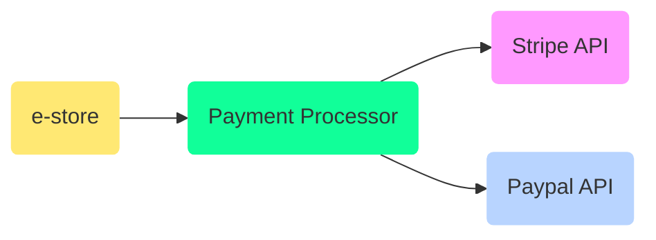

# OOP Principles in js programming

The Art of Writing [reusable, refactorable and redable code](https://github.com/ryanmcdermott/3rs-of-software-architecture) **3R's**

We spend much more time reading code than writing code!, when code is NOT written for extension.

There are 100 million programmers in the world.

* Bulk of programming is managing dependencies
* Compilers knows about the source code.
* Why is OO (object oriented) design part of every language today?
  * what so good about OO that all languages are OO these days?
  * what about COBOL, FORTRAN style programming
  * OO languages do not need pointers to functions, because they are polymorphic
* No polymorphism in C
* Carefully decide which direction the arrows between modules point?
  * thats what OO is
  * Managing dependencies by selectively re-inverting keys in your s/w


## SOLID

Introduced by [Robert Martin aka uncle bob](https://en.wikipedia.org/wiki/Robert_C._Martin)

### Single Responsibility Principle

Bad way, `change_settings` and `verify_credentials` in the same class.

Good way, seperate classes `UserAuth` and `UserSettings` based in single responsibility

* What would the reason for change of this piece of code? IF there are multiple reasons, break them down.
* In js, use modules instead of classes
* modules for logger, logger can change, toFile, toEmail, toConsole, toDatabase or all
* `calorieTracker` class, how calories are tracked, calls logger class for log

### Open for extension, closed for modification principle

* If you have to open a file and manually modify it, then you have failed in open-closed principle
* Think about extension, if your controllers (methods which operates on data change) depend on data, write helper methods to deal with data, instead of hardcoding them.
* Online quizes, options based on question types
  * using `switch` maybe a violation of open-closed principle
  * usually used in conjunction with single responsibility principle
  * break each question types into its own HandlerClass, open for extension
  * Abstracted class `printQuiz` is never touched - close for change
* instead of changing code, write new code to make work with existing code to implement a new feature

```js
const questions = [
  new BooleanQuestion('This video is useful'),
  new MultipleChoiceQuestion('what is your fav language?', ['css', 'js', 'html', 'wasm']),
  new TextQuestion('Describe your favourite js feature'),
  new RangeQuestion('What is speed limit on your city?')
]
printQuizQuestions(questions);
```

### Liskov Substitution Principle

> important principle to write OOP code

Objects in a program should be replaceable with instances of their subtypes without altering the correctness of that program.

All squares are rectangles, but not all rectangles are squares. So if in your code you replace a instance of rectangle with square, it should still work.

$$Square \subset Rectangles$$

* Use COMPOSITION, adding functionality instead of inheriting functionality
  * composition vs inheritance


### Interface Seggregation Principle

Many interfaces are better than one general purpose interface.

* Seggregating your interfaces and making them smaller
* Classes which require large settings objects
* set them to sane defaults and optional settings to change the behavious when needed.
* When a interfaces is implemented in a class, all its methods and attributes need to be defined
  * sometimes it may not be desirable to define/use them all in a class definition
  * break big classes into inheritance
  * or use composition

### Dependency Inversion Principle

> Make your code more testable, able to switch between dependencies quickly

* High level module and low level module should depend on abstractions
* Abstraction should not depend upon details, details should depend upon abstraction
* Example, store and payment gateway
* Abstraction makes behaviours more testable and we do not have to change tons of code.
* Akin to Adapter pattern, Facade Pattern
  * wrapper around external dependencies



## Composition | Inheritance

* class extensions saves us from re-implementing same behaviour in our children classes
* with composition we define what an object can do
* return behaviours as functions
* Then use multiple behaviours into a new composition Function
  * new composed function object will have all the behaviours which are needed.

## Noob vs Professional

> writing code thats easy to read is the important part

* remove redundant code
* take care of return types
* Boundary values analysis, invalid, null, NaN value handling to a logic function
* Redability over #lines
* [Guard Clause](https://blog.webdevsimplified.com/2020-01/guard-clauses/)
  * A [guard](https://en.wikipedia.org/wiki/Guard_(computer_science)) clause is simply a single piece of conditional logic at the beginning of a function which will return from the function early if a certain condition is met.
  * flatten your code, remove unnecessary nesting
  * or handle nesting smartly
* variable, function, module naming convention matters

```js
function numberToAccountingString(number) {
  if(number == null) return
  if(number < 0) reutrn `(${Math.abs(number)})`
  return number.toString()
}
```

* Bugs with `||` or default value operator
* Break out configs, and defaults to `const` values
* Use object destructuring features in setting default function parameters values
* Use `const` properly
  * when the value wont change once set throughout your code.

```js
total = total + (options.ship || 5)
```

* Dealing with asynchronous code (unreliable, time-consuming service)
* Flatten and remove nesting using `async/await` and `promises`
  * break down callback hell into Promises and async/await
* remove unnecessary side effects
* Avoid extra dependencies and implementation details leaking out of the function
  * closing the file/buffer after read/write operation is performed
  * place implementation in a seperate module, SOLID
* DRY, branch out reusable code into seperate modules
  * validations, helper functions, utilities etc.


## Resources

* https://github.com/ryanmcdermott/clean-code-javascript
* https://www.youtube.com/playlist?list=PLZlA0Gpn_vH9kocFX7R7BAe_CvvOCO_p9

<iframe width="560" height="315" src="https://www.youtube.com/embed/zHiWqnTWsn4" frameborder="0" allow="accelerometer; autoplay; encrypted-media; gyroscope; picture-in-picture" allowfullscreen></iframe>

<iframe width="560" height="315" src="https://www.youtube.com/embed/-ptMtJAdj40" frameborder="0" allow="accelerometer; autoplay; encrypted-media; gyroscope; picture-in-picture" allowfullscreen></iframe>

<Footer />

