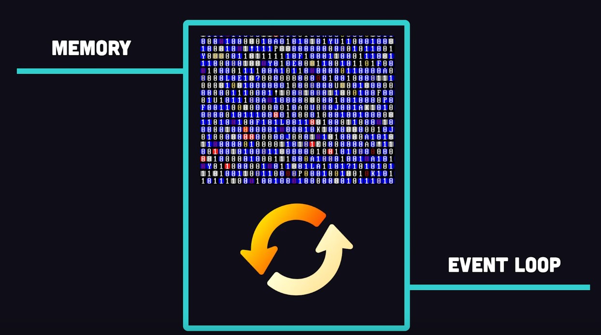
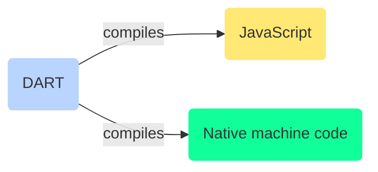

# Dart Programming Language

> open web platform, web programming language

- started in 2011
- new virtual Machine, new tools, new libraries to solve some problem
- Just Host a couple of files on webserver and BAM you have a web-application
  - supports incremental development
- Platform Independenc
  - set-top boxes
  - game consoles
  - computer, laptop, desktop, mobile, tablets
- JIT Compiler

## Dart Compiler

Dart is a programming language designed for client development,[9][10] such as for the web and mobile apps. It is developed by Google and can also be used to build server and desktop applications.

- to use with Flutter, cross platform mobile applications
- OO programming language, with class based single inheritance with interfaces
- single threaded
- optional static typing, decouple static analysis from the programming language syntax
  - toggle to enable/disable type checking
- ISOLATES for safe concurrency in programs running on multiple cores, CPUs
  - similar to Erlang, Actors posting Messages
- DOM Manipulation using dart idioms ?

> When you write hello world in dar you get 7 million line of js !!! ?

## Flutter + Dart

- Why did flutter choose dart?
- FLutter SkIA has its own rendering engine written in C++
- fast == 60 FPS and multi-platform
-

## Add Ons

- [PWA's with dart](https://pub.dev/packages/pwa)

<Footer />
