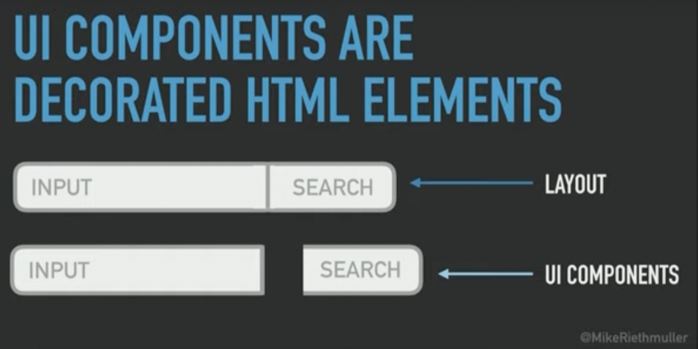

# Cascading Style Sheets

<TagLinks />

## Scoped CSS

Due to the way browsers render various CSS selectors, `p { color: red }` will be many
times **slower** when scoped (i.e. when combined with an attribute selector).
If you use `classes` or `ids` instead, such as in `.example { color: red }`,
then you virtually eliminate that performance hit.

Difference b/w scoped and unscoped CSS?[^1]

::: tip scoped CSS
Use it wisely, only when its really needed. Generalize most of the styles.
Scope only the specific styles.

==css compile time==
:::

## CSS Frameworks

Types

1. Javascript based. [bootstrap]
2. CSS only based. [w3.css], [bulma]

Why use them in the first place?

1. [x] Easier to work with responsive designs

#### CSS Framework size comparision

- https://cssfs.dev/sizes.html
- https://github.com/duongphuhiep/duongphuhiep.github.io/wiki/CSS-Framework-SIZE-comparison
- https://gist.github.com/primaryobjects/64a4e7e3351c646f51eee07949215ad4

::: theorem
CSS Framework | Gzipped Size (**KB**) | Remark
--------------|:-------------:|---------
[Vuetify] | 151 | js based
[Bulma] | 27 | css only based, no js
[Bootstrap] | 15 | css + js based
[w3.css] | 5 | pure css

::: right
[bundlephobia](https://bundlephobia.com/result?p=w3-css@4.1.0)
:::

[bulma]: https://bulma.io/
[vuetify]: https://vuetifyjs.com/en/
[bootstrap]: https://getbootstrap.com/
[w3.css]: https://www.w3schools.com/w3css/defaulT.asp

## Bulma

> navigation, typography, boxes, grid system, forms, tables , etc

- HTML tags do not have any effect, CSS classnames controls all styles
- `.block` $\rightarrow$ `.title` `.subtitle` - no padding
- is-small, is-medium, is-large
- .button, .is-primary, is-info, is-inverted, .is-outlined, is-hovered, is-loading, is-active
- `.box` has padding `.notification`
- button.delete - cross button on top right
- .tag .icon
- .message .message-header .message-body
- .nav-left|centre|right .nav-item set .is-active to make nav expand on smaller devices
- .menu .menu-label .menu-list
- .hero .hero-body
- .card .card-content .card-footer .card-footer-item
- .pagination .pagination-previous .pagination-next .pagination-list
- For blog post .level .level-left .level-item .field .control
- Forms .label .input .select .textarea **Attched** .field .has-addons .control > .button
- Grid system: .column
- [Bulma cheatsheet](http://bulmacheatsheet.com/assets/bulma-cheat-sheet-7-2-2018.pdf)

## CSS Architectures

> Define and implement consistent, maintainable and scalable css architecture

**CSS State Machines ?**

| Year | css Timeline                                                 |
| ---- | ------------------------------------------------------------ |
| 2009 | object oriented CSS - layout styles vs visual styles / skins |
| 2010 | responsive web design term was coined                        |
| 2011 | bootstrap hit the market                                     |

- Elements in HTML are object-oriented
- Layout components , Skin components, parent child components
- UI components get rendered inside Layout components
  - Size agnostic components, no harcoding for heights and widths
- { Modifiers } x { Behaviour } x { Pseudo State CSS }
  - How to cancel out illegal, undesired combinations?
- LayoutComponnets (only styles), Components (only UI elements), ContainerComponents (only logic)



```jsx
<Component css={
  modifier={"light"},
  behaviour={"pressed"}
  }
/>

const modifiers = {
  light: {
    color: '#777',
    --pressed-color: '#333'
  }
}

const behaviours = {
  pressed: {
    color: 'var(--pressed-color, #777)',
  }
}

export const style = ({modifier, bahaviour}) => ({
  fontSize: 1em,
  ...modifiers[modifier],
  ..behaviours[behaviour]
})
```

1. How many UI states can a component have?
2. How can you easily validate these states?
3. How ergonomic are your styles?
4. Are you creating sensible abstract building blocks?
5. Are you seperarting layout from visual styles when appropriate?
6. Are you seperating application logic?
7. How do we give semantic meaning to compoentns?
8. [Frontend architecture](http://nicolasgallagher.com/about-html-semantics-front-end-architecture/)

[^1]: https://stackoverflow.com/questions/46173945/difference-between-scoped-css-and-scope-by-adding-a-parent-class

<Footer />
